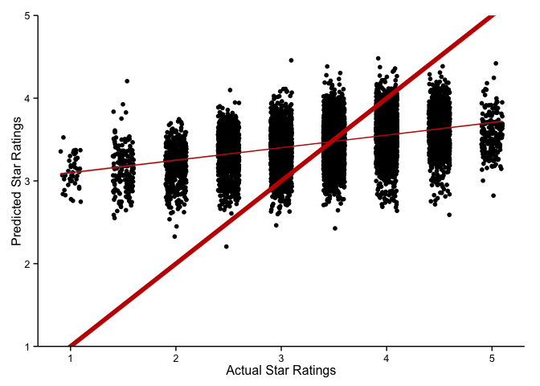

```{r, echo=FALSE, message=FALSE}
library(rjson)
library(plyr)
library(dplyr)
library(ggplot2)
library(knitr)
library(glmnet)
library(googleVis)
library(DT)
library(scales)

# Load the data.
load("yelpdata.rdata")

#Clean data.
clean.names <- function(df){
  colnames(df) <- gsub("[^[:alnum:]]", "", colnames(df))
  colnames(df) <- tolower(colnames(df))
  return(df)
}
yelpdata <- clean.names(yelpdata)
yelpdata <- yelpdata[,!duplicated(colnames(yelpdata))]

# Modify data. 
yelpdata$stars <- as.numeric(as.character(yelpdata$stars))
yelpdata$reviewcount <- as.numeric(as.character(yelpdata$reviewcount))
names(yelpdata)[names(yelpdata)=="attributeshappyhour"] <- "happyhour"
names(yelpdata)[names(yelpdata)=="attributesacceptscreditcards"] <- "acc"
names(yelpdata)[names(yelpdata)=="attributesgoodforgroups"] <- "groups"
names(yelpdata)[names(yelpdata)=="attributesoutdoorseating"] <- "outdoor"
names(yelpdata)[names(yelpdata)=="attributespricerange"] <- "price"
names(yelpdata)[names(yelpdata)=="attributesalcohol"] <- "alcohol"
names(yelpdata)[names(yelpdata)=="attributesnoiselevel"] <- "noiselevel"
names(yelpdata)[names(yelpdata)=="attributesambienceclassy"] <- "classy"
names(yelpdata)[names(yelpdata)=="attributesparkingvalet"] <- "valet"
names(yelpdata)[names(yelpdata)=="neighborhoods"] <- "nhood"
names(yelpdata)[names(yelpdata)=="attributesdrivethru"] <- "drivethru"
names(yelpdata)[names(yelpdata)=="attributesparkinglot"] <- "parkinglot"
names(yelpdata)[names(yelpdata)=="attributesparkinglot"] <- "parkinglot"
names(yelpdata)[names(yelpdata)=="attributespaymenttypescashonly"] <- "cash"
names(yelpdata)[names(yelpdata)=="attributesambiencecasual"] <- "casual"
names(yelpdata)[names(yelpdata)=="attributesgoodfordancing"] <- "dance"
names(yelpdata)[names(yelpdata)=="attributesdelivery"] <- "delivery"
names(yelpdata)[names(yelpdata)=="attributescoatcheck"] <- "ccheck"
names(yelpdata)[names(yelpdata)=="attributestakeout"] <- "takeout"
names(yelpdata)[names(yelpdata)=="attributestakesreservations"] <- "res"
names(yelpdata)[names(yelpdata)=="attributeswaiterservice"] <- "service"
names(yelpdata)[names(yelpdata)=="attributesparkingstreet"] <- "street"
names(yelpdata)[names(yelpdata)=="attributesparkinggarage"] <- "garage"
names(yelpdata)[names(yelpdata)=="attributesgoodforlatenight"] <- "late"
names(yelpdata)[names(yelpdata)=="attributesgoodfordessert"] <- "desert"
names(yelpdata)[names(yelpdata)=="attributescaters"] <- "caters"
names(yelpdata)[names(yelpdata)=="attributeswifi"] <- "wifi"
names(yelpdata)[names(yelpdata)=="attributesattire"] <- "attire"
names(yelpdata)[names(yelpdata)=="attributesgoodforkids"] <- "goodforkids"
names(yelpdata)[names(yelpdata)=="attributeshastv"] <- "tv"
names(yelpdata)[names(yelpdata)=="attributesambienceromantic"] <- "romantic"
names(yelpdata)[names(yelpdata)=="attributesambiencetrendy"] <- "trendy"
names(yelpdata)[names(yelpdata)=="attributesambienceupscale"] <- "upscale"
names(yelpdata)[names(yelpdata)=="attributesambiencedivey"] <- "divey"
names(yelpdata)[names(yelpdata)=="attributeswheelchairaccessible"] <- "wheelchair"
names(yelpdata)[names(yelpdata)=="attributesmusicbackgroundmusic"] <- "bkgmusic"
names(yelpdata)[names(yelpdata)=="attributesmusiclive"] <- "livemusic"
names(yelpdata)[names(yelpdata)=="attributesbyob"] <- "byob"
names(yelpdata)[names(yelpdata)=="attributesdogsallowed"] <- "dogsallowed"
names(yelpdata)[names(yelpdata)=="attributesopen24hours"] <- "open24hrs"
names(yelpdata)[names(yelpdata)=="attributespaymenttypesamex"] <- "amex"
names(yelpdata)[names(yelpdata)=="attributesorderatcounter"] <- "orderatcounter"
names(yelpdata)[names(yelpdata)=="attributespaymenttypesvisa"] <- "visa"

# Change <NA> to "dnr" (did not respond).
addDNR <- function(x){
  if(is.factor(x)) return(factor(x, levels=c(levels(x), "dnr")))
  return(x)
}
yelpdata <- as.data.frame(lapply(yelpdata, addDNR))
yelpdata[is.na(yelpdata)] <- "dnr"

# Make city/state column to consolidate and clarify vague city and state labels.
yelpdata <- mutate(yelpdata, loc = ifelse(yelpdata$state=="NV", "Las Vegas, NV",
                                        ifelse(yelpdata$state=="PA", "Pittsburg, PA",
                                          ifelse(yelpdata$state=="NC", "Charlotte, NC",
                                            ifelse(yelpdata$state=="AZ", "Phoenix, AZ",
                                              ifelse(yelpdata$state=="IL", "Urbana-Champaign, IL",
                                                ifelse(yelpdata$state=="WI", "Madison, WI",
                                                  ifelse(yelpdata$state=="MLN", "Edinburgh, UK",
                                                    ifelse(yelpdata$state=="BW", "Karlsruhe, Germany",
                                                      ifelse(yelpdata$state=="QC", "Montreal, Canada",  
                                                       ifelse(yelpdata$state=="ON", "Waterloo, Canada",
                                                        ifelse(yelpdata$state=="SC", "Charlotte, NC",
                                                         ifelse(yelpdata$state=="EDH", "Edinburgh, UK",
                                                          ifelse(yelpdata$state=="KHL", "Edinburgh, UK",
                                                           ifelse(yelpdata$state=="XGL", "Edinburgh, UK",
                                                            ifelse(yelpdata$state=="NTH", "Edinburgh, UK",
                                                            ifelse(yelpdata$state=="SCB", "Edinburgh, UK",
                                                         NA)))))))))))))))))

# Pick out the restaurants.
all_restaurants <- filter(yelpdata, categories == "Restaurants" |
                     categories1 == "Restaurants" | 
                     categories2 == "Restaurants"| 
                     categories3 == "Restaurants"|
                     categories4 == "Restaurants"|
                     categories5 == "Restaurants"|
                     categories6 == "Restaurants"|
                     categories7 == "Restaurants"|
                     categories8 == "Restaurants"|
                     categories9 == "Restaurants"|
                     categories10 == "Restaurants") 

# Display all of the categories of a restaurants from all of the seven columns.
bigcat <- c(as.character(all_restaurants$categories1), 
            as.character(all_restaurants$categories2), 
            as.character(all_restaurants$categories3),
            as.character(all_restaurants$categories4), 
            as.character(all_restaurants$categories5), 
            as.character(all_restaurants$categories6),
            as.character(all_restaurants$categories7), 
            as.character(all_restaurants$categories8), 
            as.character(all_restaurants$categories9),
            as.character(all_restaurants$categories10),
            as.character(all_restaurants$categories)) %>% 
  table() %>% 
  sort()

# This function creates a column for a category, 1 = yes, 0 = no.
varmaker <- function(x){
  all_restaurants <- mutate(all_restaurants, 
                            a = 
                              ifelse(
                                categories == x |
                                categories1 == x | 
                                categories2 == x | 
                                categories3 == x | 
                                categories4 == x | 
                                categories5 == x | 
                                categories6 == x | 
                                categories7 == x | 
                                categories8 == x | 
                                categories9 == x | 
                                categories10 == x , 1, 0) )
  all_restaurants$a <- as.factor(all_restaurants$a)
  names(all_restaurants)[names(all_restaurants)=="a"] <- gsub(" ", "", x, fixed = TRUE)
  return(all_restaurants)
  }

# Make the new columns.
all_restaurants <- varmaker("Fast Food")
all_restaurants <- varmaker("Pizza")
all_restaurants <- varmaker("Mexican")
all_restaurants <- varmaker("American (Traditional)")
all_restaurants <- varmaker("Nightlife")
all_restaurants <- varmaker("Sandwiches")
all_restaurants <- varmaker("Bars")
all_restaurants <- varmaker("Food")
all_restaurants <- varmaker("Italian")
all_restaurants <- varmaker("Chinese")
all_restaurants <- varmaker("American (New)")
all_restaurants <- varmaker("Burgers")
all_restaurants <- varmaker("Breakfast & Brunch")
all_restaurants <- varmaker("Cafes")
all_restaurants <- varmaker("Japanese")
all_restaurants <- varmaker("Sushi Bars")
all_restaurants <- varmaker("Delis")
all_restaurants <- varmaker("Steakhouses")
all_restaurants <- varmaker("Seafood")
all_restaurants <- varmaker("Chicken Wings")
all_restaurants <- varmaker("Sports Bars")
all_restaurants <- varmaker("Coffee & Tea")
all_restaurants <- varmaker("Mediterranean")
all_restaurants <- varmaker("Barbeque")
all_restaurants <- varmaker("Thai")
all_restaurants <- varmaker("Asian Fusion")
all_restaurants <- varmaker("French")
all_restaurants <- varmaker("Buffets")
all_restaurants <- varmaker("Indian")
all_restaurants <- varmaker("Pubs")
all_restaurants <- varmaker("Greek")
all_restaurants <- varmaker("Diners")
all_restaurants <- varmaker("Bakeries")
all_restaurants <- varmaker("Vietnamese")
all_restaurants <- varmaker("Tex-Mex")
all_restaurants <- varmaker("Vegetarian")
all_restaurants <- varmaker("Salad")
all_restaurants <- varmaker("Hot Dogs")
all_restaurants <- varmaker("Middle Eastern")
all_restaurants <- varmaker("Event Planning & Services")
all_restaurants <- varmaker("Specialty Food")
all_restaurants <- varmaker("Lounges")
all_restaurants <- varmaker("Korean")
all_restaurants <- varmaker("Canadian (New)")
all_restaurants <- varmaker("Arts & Entertainment")
all_restaurants <- varmaker("Wine Bars")
all_restaurants <- varmaker("Gluten-Free")
all_restaurants <- varmaker("Latin American")
all_restaurants <- varmaker("British")
all_restaurants <- varmaker("Gastropubs")
all_restaurants <- varmaker("Ice Cream & Frozen Yogurt")
all_restaurants <- varmaker("Southern")
all_restaurants <- varmaker("Vegan")
all_restaurants <- varmaker("Desserts")
all_restaurants <- varmaker("Hawaiian")
all_restaurants <- varmaker("German")
all_restaurants <- varmaker("Bagels")
all_restaurants <- varmaker("Caterers")
all_restaurants <- varmaker("Juice Bars & Smoothies")
all_restaurants <- varmaker("Fish & Chips")
all_restaurants <- varmaker("Ethnic Food")
all_restaurants <- varmaker("Tapas Bars")
all_restaurants <- varmaker("Soup")
all_restaurants <- varmaker("Halal")
```


## Anatomy of a Yelp Review

Restaurants on Yelp:

- star rating
- text reviews
- category
- attributes
- location
- other information

Example:

- [PDX Sliders](http://www.yelp.com/biz/pdx-sliders-portland)

## The Goal

Use everything except text reviews to predict star ratings.

- no food-quality rating, our model won't be perfect
- modified linear model

## The Yelp Dataset

Yelp Dataset

- JSON format
- 118 variables per business
- 21,892 listed restaurants 

Modifications

- dealing with categories
- changing NA's to DNR's

## Where are the Restaurants?

The US, Canada, Germany, and the UK.

```{r results="asis", echo=FALSE, warning=FALSE}
all_restaurants$latlong <- paste(all_restaurants$latitude, all_restaurants$longitude, sep=":")
counts <- all_restaurants %>% 
  group_by(loc) %>%
  summarize(Restaurants = n(),  Avg_Rating = round(mean(stars),2))

locdata <- data.frame(latlong = all_restaurants$latlong, 
                      loc = all_restaurants$loc)

counts <- inner_join(counts, locdata, by="loc") %>%
  group_by(loc) %>%
  summarize(Restaurants = first(Restaurants), 
            latlong = first(latlong),
            Avg_Rating = first(Avg_Rating))

require(datasets)

USmap <- gvisGeoChart(counts, "loc", 
                          sizevar="Restaurants",
                          colorvar="Avg_Rating", 
                          options=list(region = 'US',
                                       displayMode = "markers",
                                       colorAxis="{colors:['white', '#c41200']}"))

Europemap <- gvisGeoChart(counts, "loc", 
                          sizevar = "Restaurants",
                          colorvar = "Avg_Rating", 
                          options=list(region = '150',
                                       displayMode = "markers",
                                       colorAxis="{colors:['white', '#c41200']}"
                                       ))


print(gvisMerge(USmap, Europemap, horizontal=TRUE), "chart")
```

## Star Rating Distribution


Left-Skewed Distribution

## LASSO Method of Linear Regression {.build}

In linear regression, find $b_j$ in:
$$ \hat{y}~=~b_0~+~b_1x_1~+~...~+~b_kx_k , $$
that minimizes the value of $\sum{(y-\hat{y})^2}$.


With LASSO regression we impose an additional constraint: 
$$\sum{| b_j |} \leq s .$$

A small $s$ will make unimportant $b_j$'s go to zero.

Thus, we can analyze **hundreds of variables** without worrying about **overfitting**.

## Analysis Outline {.build}

Divide dataset in two:

- training
- testing.

Train model using `glmnet` command.

Pick appropriate $s$ value.

Predict ratings of test dataset.

## Sweet Spot - Coefficients


## Sweet Spot - Mean Square Error


## Prediction



## Results

```{r, echo=FALSE}
library(dplyr)
# Make dataset with predictors.
dataset <- all_restaurants %>%
  select(businessid,
         stars,   
         city,
         price,
         alcohol,
         noiselevel,
         classy,
         valet,
         cash,
         nhood,
         drivethru,
         parkinglot,
         casual,
         dance,
         delivery,
         ccheck,
         takeout,
         res,
         service,
         street,
         garage,
         late,
         desert,
         caters,
         wifi,
         goodforkids,
         tv,
         romantic,
         trendy,
         upscale,
         divey,
         wheelchair,
         bkgmusic,
         livemusic,
         byob,
         dogsallowed,
         open24hrs,
         amex,
         orderatcounter,
         visa
         )

dataset <- left_join(dataset, all_restaurants[c(1,119:(length(all_restaurants)-1))], by = "businessid")
dataset <- subset(dataset, select = -businessid)

# Define make predictors into a matrix.
x <- model.matrix(stars ~ ., data = dataset)[,-1]
y <- dataset$stars

grid=10^seq(10,-2, length =100)

# Train the LASSO model. Make plot of coefficients for increasing "s".
lasso.mod <- glmnet(x, y, alpha=1, lambda=grid)

set.seed(1)
cv.out <- cv.glmnet(x, y, alpha=1)
bestlam <- cv.out$lambda.min


out <- glmnet(x, y, alpha=1, lambda=grid)
lasso.coef <- predict(out, type="coefficients", s=bestlam) [-1,] %>% data.frame()
names(lasso.coef)[names(lasso.coef)=="row.names"] <- "Variable"
names(lasso.coef)[names(lasso.coef)=="."] <- "Coefficient"
lasso.coef$Coefficient <- round(as.numeric(lasso.coef$Coefficient), 3) 
datatable(lasso.coef, options=list(pageLength=5))
```

## Conclusions

Used LASSO method to measure the effect of various business attributes. 

Results not necessarily **causal**, most relationships appear to be **correlations**.
