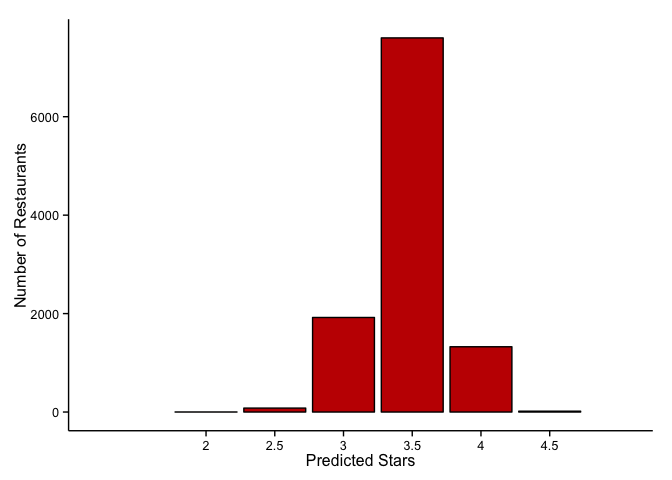

# Yelp Data Analysis

## Motivation

We've all been there. It's 7:00 PM, you're in an unfamiliar part of town with some friends, and everyone's hungry but nobody can decide where to eat. Everyone pulls out their phones to see what's nearby, but being the snobs you are, you guys can't just pick any restaurant. You need something solid. At the very least 4 stars. Eventually you narrow it down to a couple of 4 star restaurants and one 4.5 star restaurant. In the end, you all go with the 4.5 star restaurant, since it's presumably the best. 

In our review-obsessed culture, we often look to the internet for decisions. When finding a place to eat, we want a single number that makes our decision easy. But at the end of the day, what is the difference between a 4 star restaurant and a 4.5 star restaurant? We'd assume that the quality of food is central to this rating, but what other factors play a role in a restaurants rating? In this analysis, my goal is to make a linear model to see how various attributes of a restaurant affect it's ratings on Yelp. Ideally, this information could be used to help restaurant owners discover what sorts of attributes will make the customer's experience better.

## Overview

We'll start our analysis by looking at the distribution of restaurant ratings. I'll make a predictive LASSO model using these attributes as inputs. We'll train the model with the first half of the data set, and test it using the second half of the data set to see how accurate the model is. Finally, we'll see how specific attributes of restaurants affect the ratings. 

## About Yelp Reviews

On Yelp, registered users give restaurants a rating between 1 and 5 stars, along with a text review consisting of a few sentences. In order to ensure ratings are trustworthy, Yelp only includes ratings that it deems "unbiased" (according to a computer model) so that any rants, reviews from single-review-accounts, and other potentially damaging or flawed reviews are not included in the overall review. (These reviews can still be accessed).

## Data Exploration - Restaurant Star Ratings
 
Let's look at the overall number of restaurants by rating. Naively we'd expect a normal distribution, but the plot shows a right skew. We can expect that (1) better restaurants tend to stick around (and the bad ones tend to close) or that (2) people may not be rating "normal"-y.

We can also look at a histogram of the number of reviews per restaurant. The plot below shows that most tend to have fewer than 10 reviews. The number of restaurants with a certain number of ratings begins to decay as this number of ratings increases.

We can also look to see how this distrubution changes if we divide the plots by star rating.

For the most part, the left skewed distribution seems relatively consistent for all ratings. As we go from 1 star restaurants to 4 star restaurants though, we see that the peak of the skewed distribution keeps moving to the right, indicating that there are more reviews for better rated restaurants. However, for restaurants of 4.5 and 5 stars, the peak scoots back to the left. We can get a sense of this by looking at a boxplot of the number of reviews by star rating.

What can we make of the low mean number of reviews for 5 star restaurants? Perhaps that most 5 star restaurants recieve that rating by chance; with a small sample size of 3 or 4 reviews, there will inevitably be a few restaurants that are rated 5 stars for each of those reviews. As the sample size (number of reviews) increases, the yelp rating will begin to approach this restaurants "true" rating, which will most likely not be 5 stars. The same probably occurs for 1 star restaurants as well, but there is an added consequence: if you are a 1 star restaurant, you probably won't be open for very long...

## Data Exploration - By City

Where is our data coming from?

<!-- GeoChart generated in R 3.1.3 by googleVis 0.5.8 package -->
<!-- Mon May 11 18:38:25 2015 -->

<!-- jsHeader -->

 
<!-- jsChart -->  

<!-- jsChart -->  

 
<table border="0">
<tr>
<td>

<!-- divChart -->
  

</td>
<td>

<!-- divChart -->
  

</td>
</tr>
</table>

Finally, let's get a sense of how the reviews vary by city.

         City            Restaurants    Average Star Rating of Restaurants    Average Number of Ratings per Restaurant 
----------------------  -------------  ------------------------------------  ------------------------------------------
          NA                 19                        4.00                                     5.58                   
    Edinburgh, UK           1137                       3.81                                    14.47                   
  Karlsruhe, Germany         469                       3.71                                    11.88                   
   Montreal, Canada         2353                       3.61                                    16.16                   
    Pittsburg, PA           1361                       3.55                                    37.38                   
   Waterloo, Canada          244                       3.55                                    10.03                   
     Madison, WI             981                       3.45                                    34.10                   
    Charlotte, NC           2119                       3.43                                    33.74                   
     Phoenix, AZ            7985                       3.43                                    51.23                   
    Las Vegas, NV           4960                       3.42                                    90.13                   
 Urbana-Champaign, IL        264                       3.38                                    34.28                   

For the 10 cities given in this model, it would appear that the the average star rating will be larger if the average number of reviews by restaurant is lower. 

## LASSO Model

Now we want to create a model that uses various business attributes to predict the star rating of a restaurant. 

The LASSO flavor of linear regession (Least Absolute Shrinkage and Selection Operator) involves finding an ideal parameter in order to reduce possibility of overfitting. When fitting a linear regression, we are looking for the values $b_j$ that correspond to inputs $x_j$ and $\hat{y}$:

$$ \hat{y}~=~b_0~+~b_1x_1~+~...~+~b_kx_k . $$

Normally in linear regression, we seek to find the coefficients that minimize the value of $\sum{(y-\hat{y})^2}$, but with LASSO regression we impose an additional constraint: 

$$\sum{| b_j |} \leq s,$$

so the sum of the magnitude of all of the coefficients cannot exceed the value of $s$, a tunable parameter. If we make $s$ small (but still greater than zero), then the coefficients of unimportant parameters go to zero, and are thus not really included in the model. As a result, only the variables with a significant impact will appear in the model.

How do we find this value of $s$? It's a trade-off between the smallest error and the fewest number of variables. 

As predictors, we'll most of the relevant variables included for restaurants in the dataset. This includes categories (i.e. Chinese, American, Breakfast), the geographic location (city, neighborhood), and various attributes (parking, wifi, classy). 

We'll examine the accuracy of this model by splitting the data set in half. The first half will be used to train the model that will be tested on the second half. 

The plot above shows how the values of coefficients change for an increasing lasso parameter $s$ (x-axis).
The key variables are the ones that "jump out" early on. 

Below we see the change in Mean-Squared Error ($\frac{1}{k}\sum{(y-\hat{y})^2}$) as a function of a changing $s$ (which is proportional to the $log(\lambda)$ at the bottom of the x-axis). The top of the x-axis shows the number of variables included in the model. We find the ideal $s$ value at the dip, where the mean-square value is the lowest.

The plot above compares the actual and the predicted results. The red line shows where a perfect predictions would fall, and the black points represent individual predictions. Our model does a good job of capturing the overall trend of the star ratings, but fails to predict any outliers. Most predictions are between 4.5 and 2.5 stars, but fails to predict any outliers of 1, 2, or even 5 stars. But this sort of makes sense because most restaurants have ratings of 3.5 or 4 stars, as we saw at the very beginning. 

Compared to the first histogram showing the distribution of all of the ratings, the histogram made from our predicted model has a much sharper peak.

The largest coefficients are shown in the table below:

<!--html_preserve-->

<!--/html_preserve-->

Overall, we see that the top ten positive variables have to do with the location in the city, so I guess there is something to be said about the location. This could mean a wealthier neighborhood thus better quality food, or also that the population rates easier, or even that good restaurants tend to group together. Besides the location, categories like 'Latin American' 'French' 'Food'(?) and 'Vegan' tended to be better rated. Things that negatively impacted the rating were, again, categories like 'Buffets' 'Chicken Wings' 'Fast Food' or 'Burgers', but also things like a 'very loud' or a 'loud' noise levels, and (everyones least favorite) paid wifi.

Also, it's worth noting that lack of responses tended to hurt a restaurants rating. When establishments failed to provide information (listed as 'dnr' = 'did not respond'), it means that consumers won't be making informed decisions, which could lead to a bad time and negative reviews. These were things like failing to answer whether or not a restaurant was 'upscale', whether dogs were allowed, or whether or not they served desert. Filling in these responses resulted in better ratings in every single category except 'drive-thru: TRUE', 'wifi: paid', 'delivery: TRUE', 'garage: TRUE', and 'open-late:TRUE'. 

## Conclusions

Our analysis isn't perfect, but then again, it wasn't meant to be perfect. We're trying to get a sense of the kinds of trends we see on the large scale, without looking at the food quality. Of course there will be some shabby restaurants with excellent food, and other restaurants that have all the "attribute" boxes ticked but lack good food. Without the information on the food, we have focus on other attributes. What does the analysis on these attributes tell us?

We'll if you're a restaurant owner, consider filling out all of your yelp attributes, since many restaurants were penalized for lack of responses. Next, is it possible to make your establishment quieter? Loud and very loud restaurants recieved lower ratings. If you're going to offer wifi, make if free or don't bother. Finally, if you are thinking about opening a restaurant, take great care in where you choose to set up shop. Location (i.e. neighborhood) can play a major role in a restaurants ratings.

It's important to keep in mind that correlation isn't causation, and that just because we see differences between attributes doesn't necessarily mean that fixing certain problems will immediatly yield better ratings. On the other hand, making some of the improvements outlined above certainly won't make ratings worse!

## Acknowledgments 

I'd like to thank Albert for helping me with this project, and for teaching me R and introducing me to statistics. I'd also like to thank Yelp for publishing the data set. 
